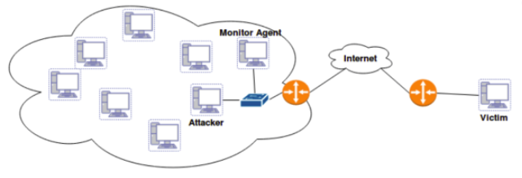

# SafeCorporate

SafeCorporate was developed at [Aveiro University](https://www.ua.pt) in the course [Network Awareness](http://sd.web.ua.pt/App_Upload/Opcoes/2017/2/480_TPR_Programa.pdf) for academic purposes and intents to demonstrate the steps needed in order to detect denial of service attacks, using a Source-End approach. 

This project is divided in three phases:
1. Get data
	* It only supports netflow version 5.
	* We adopted an alternative solution: we got raw packets and then them were converted, using a script, in netflow v5 records.
2. Process data
	* Filter and group features.
	* Build new features for 2 time windows
	* In this phase, it also have traffic classification and the analysis of the usual traffic of a network and by a statistical analysis, infers if there is any abnormality in the traffic.
3. Test using Artificial Inteligence
	* It only supports 2 models: Neural Network and Support Vector Machine 

This proposal takes only in consideration SYN-DDoS attacks. 

#### Architecture

### Installation and Configuration
	1. Clone this repository
	2. Install the requirements

	General Usage
	-----

	    Usage:
		# Create a mongodb connection, ie: mongodb://localhost:27017/

		cd ProjectNetworkAwareness/NetFlowParser
		# Get netflows and dump them to a mongo db
		python3 NetFlow_Parser.py -d UserProfiling
		python3 NetFlow_Parser.py -d Anomalies

		cd ../DataHandler

		# Filter and group
		python3 FeatureSelector -c

		# Produce features for small time window for normal activity
		python3 FeatureSelector -d ClearUserProfiling -t 5 -l 0
		# Produce features for big time window for normal activity
		python3 FeatureSelector -d ClearUserProfiling -t 120 -l 0

		# Produce features for small time window for anormal activity
		python3 FeatureSelector -d ClearAnomalies -t 5 -l 1
		# Produce features for big time window for normal activity
		python3 FeatureSelector -d ClearAnomalies -t 120 -l 1

		# Test Neural Network for features mapped by small time window
		# It is possible to test normal activity, anormal activity and both
		python3 machineLearning.py -f modelNNS.pkl -ts

		# Test Neural Network for features mapped by big time window
		# It is possible to test normal activity, anormal activity and both
		python3 machineLearning.py -f modelNNB.pkl -tb

		# To test support vector machine, change:
		- filename : machineLearning -> machineLearning_svm
		- model file: modelNN# -> modelSVM# 

## Licence

MIT